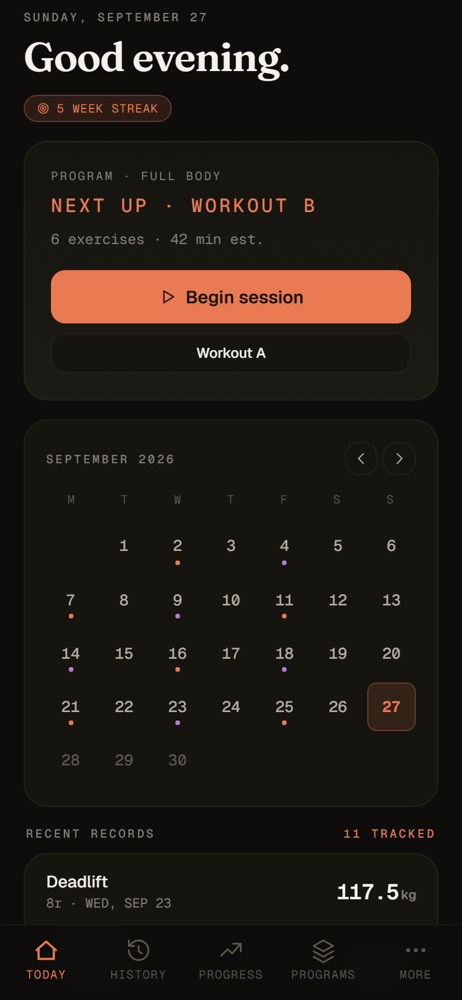
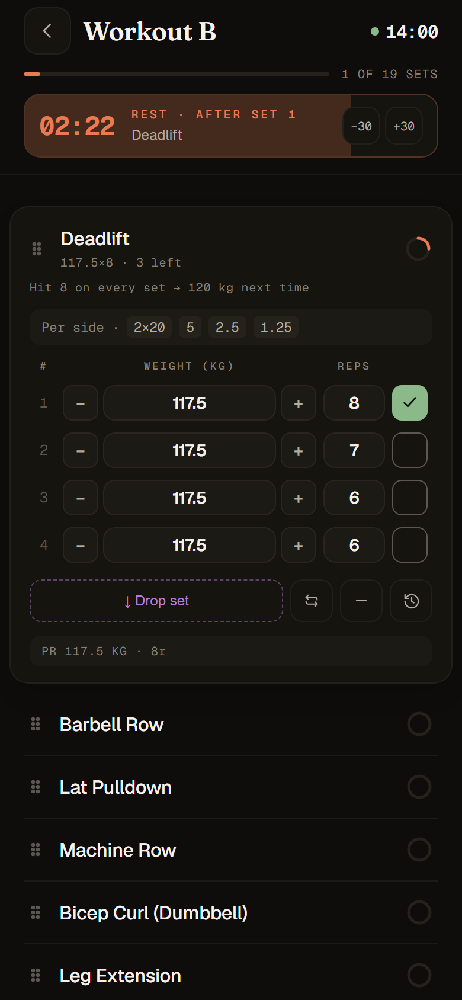
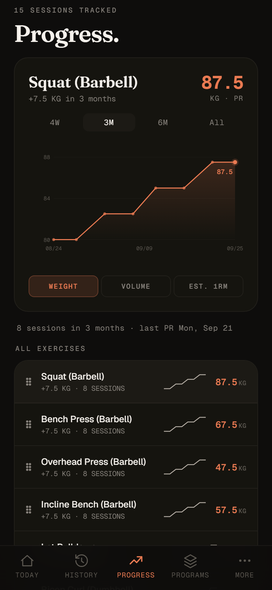
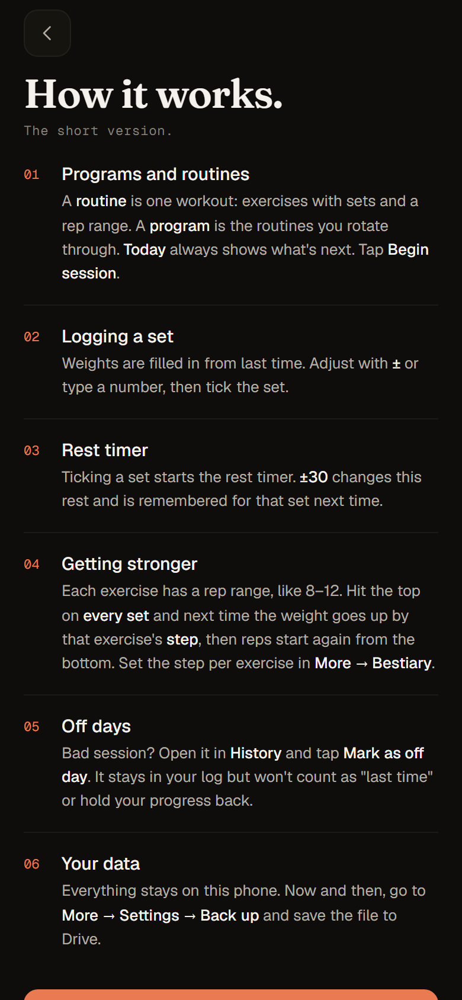
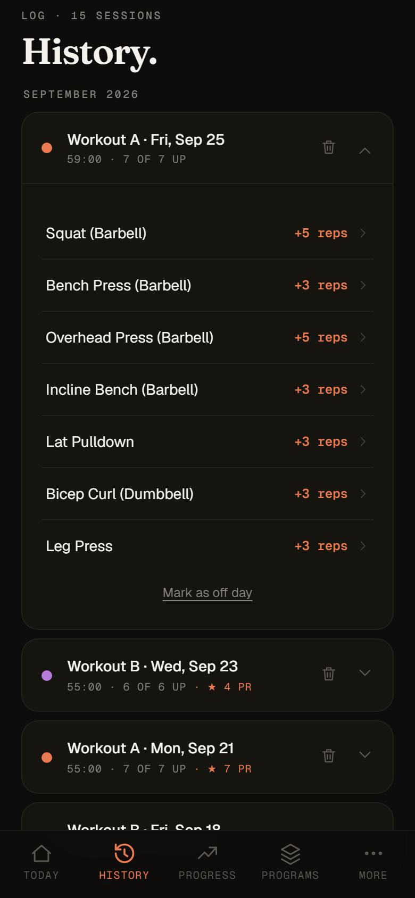
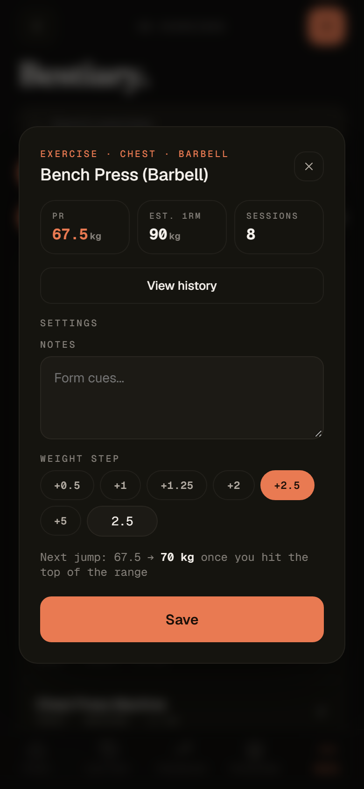

# Workout Tracker

A quiet, offline training log for Android. Log sets in a tap, let the rest timer run (it rings even with the phone locked), and let double progression tell you when to add weight. There's no account and no cloud: your data stays on your phone.

<p>
  
  
  
</p>

## Install

The app isn't on the Play Store. You install it straight from this repo's releases.

1. On your phone, open **[the latest release](https://github.com/nbilic/w-tracker/releases/latest)** and tap the `.apk` file under **Assets**.
2. If Chrome warns that the file may be harmful, tap **Download anyway**.
3. Open the downloaded file. Android will ask you to allow installs from Chrome: tap **Settings**, turn on **Allow from this source**, then go back.
4. Tap **Install**. If Play Protect warns about an unknown developer, tap **More details → Install anyway**.
5. Open **Workout Tracker**. It starts with a one-screen guide to how it works.

Needs Android 7.0 or newer.

## Updates

The app checks for new versions by itself (at most every few hours, never during a workout). When one is out, a row on **Today** says **Update available**. Tap it to see what's new, then **Install**.

- The first time, Android asks you to allow the app to install updates. Turn on **Allow from this source** and come back.
- You confirm each install on Android's prompt. Your data is kept.
- To check yourself: **More → Settings → App updates**.

## Using it

<p>
  
  
  
</p>

- **Programs and routines:** a routine is one workout (exercises with sets and a rep range), and a program is the routines you rotate through. **Today** shows what's next. Tap **Begin session**.
- **Logging:** weights are filled in from last time. Adjust with **±** or type, then tick the set.
- **Rest timer:** starts when you tick a set. **±30** changes this rest and is remembered for that set next time. On the app, the alarm fires even with the phone locked.
- **Getting stronger:** hit the top of the rep range on every set and next time the weight goes up by the exercise's **step** (set it per exercise in **More → Bestiary**). Reps then start again from the bottom of the range.
- **Off days:** in **History**, open a session and tap **Mark as off day**. It stays in your log but won't count as "last time" or hold your progress back.
- **During a workout:** a notification shows the elapsed time, and during rests a countdown with **+30s** and **Skip rest**, on the lock screen too.
- **Shortcuts:** long-press the app icon to start your next routine, or continue the workout you're in.
- **Widget:** add *Workout Tracker* from your home screen's widget list to see what's next and this week's training days, with a button that starts it.
- The same guide is in the app under **More → How it works**.

## Your data

Everything is stored on the phone, in the app.

- **Back up:** **More → Settings → Back up** opens the share menu with a `.json` file. Save it to Google Drive (or email it to yourself).
- **Restore:** **More → Settings → Restore from backup** and pick that file. Your current data is kept as a snapshot, so you can undo it from Settings.
- **New phone:** with Google backup on (Android **Settings → Google → Backup**), a copy of your data is backed up automatically. After reinstalling, the app offers to restore it.

**Coming from the old web version?** In the web app, go to Settings → **Back up** and save the file to Drive. In the Android app, go to Settings → **Restore from backup** and pick it.

## Development

The whole app is one file, `index.html` (vanilla JS, no framework), wrapped as an Android app with [Capacitor](https://capacitorjs.com/). Opening `index.html` in a browser runs the web version, which is handy for quick checks.

```
index.html              the app
fonts/                  bundled fonts (Fraunces, Geist, Geist Mono)
assets/                 icon and splash sources (regenerate with npx @capacitor/assets generate --android)
android/                Capacitor Android project, incl. the in-app updater plugin (ApkInstallerPlugin.java)
scripts/build-web.js    copies the app into www/ for Capacitor
scripts/wait-release.js waits for a tag's CI build and reports the release
scripts/screenshots.js  regenerates docs/screenshots (npm run screenshots)
```

**Build locally** (needs Node 22 and JDK 21; the Android SDK is only needed for local Gradle builds):

```sh
npm ci
npm run sync                         # build www/ and copy it into the Android project
cd android && ./gradlew assembleDebug
```

**Release:** CI builds, signs and publishes on a version tag. The tag message becomes the release notes shown in the app, so write it for the user.

```sh
git tag -a v1.2.0 -m "Short title

- What changed, in plain words"
git push origin v1.2.0
node scripts/wait-release.js v1.2.0   # optional: wait for the release
```

Signing uses four repository secrets: `ANDROID_KEYSTORE_B64`, `ANDROID_KEYSTORE_PASSWORD`, `ANDROID_KEY_ALIAS` and `ANDROID_KEY_PASSWORD`. Keep the keystore backed up. Updates must be signed with the same key, or the app has to be reinstalled.
